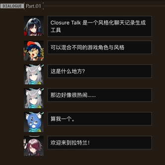
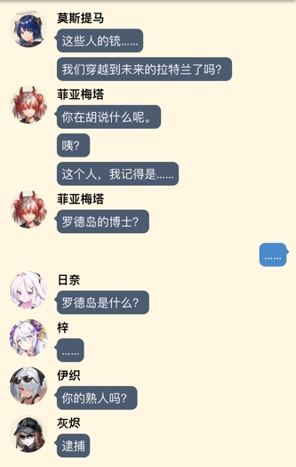

# Closure Talk

风格化聊天记录生成器。[立即尝试](https://closuretalk.github.io)

## 使用指南

1. 页面顶部可改语言
1. 在左侧搜索角色，可以用任意语言搜索
1. 点击一个头像将它加入右下角并激活
1. 点击右下角头像可以激活角色，快捷键是 `Ctrl+数字`
    - `Ctrl+1` 切换到“玩家”（刀客塔或者老师）
    - `Ctrl+2` 切换到第一个头像，依此类推
1. 打字聊天。按回车发送消息，按 `Shift+回车` 换行
1. 点击聊天框左侧头像发送表情包和图片，或者发送特殊对话
1. 页面右上角按钮：
    - 保存截图
    - 保存文本
    - 载入之前保存的文本

## 编辑聊天记录

1. 左键单击聊天气泡后，可以在这个气泡后插入新的聊天内容
1. 右键单击聊天气泡可以编辑内容、设置头像显示、删除这条
1. 点击空白处后，用 `Ctrl/Cmd+Z` 和 `Ctrl/Cmd+Y` 撤销和重做聊天编辑

## Credits

This project is inspired by [Yuzutalk](https://www.yuzutalk.net). The Yuzutalk-style renderer is also taken from their website.

Character metadata sources:

- _Arknights_ from [Kengxxiao/ArknightsGameData](https://github.com/Kengxxiao/ArknightsGameData)
- _Blue Archive_ from [YuzuTalk/translation](https://github.com/YuzuTalk/translation)
- Some _Blue Archive_ Chinese translation from [B站碧蓝档案WIKI](https://wiki.biligame.com/bluearchive)

## Copyrights

- _Arknights_ avatar copyrights belong to [HyperGryph](https://ak.hypergryph.com)
- _Blue Archive_ avatar and stamp copyrights belong to [Yostar & NEXON Games](https://bluearchive.jp)
