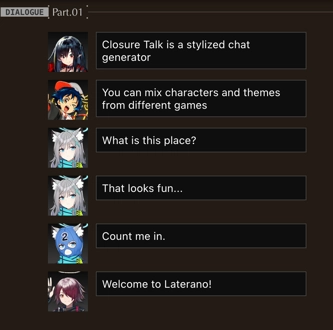
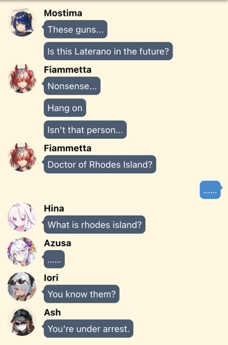

# Closure Talk

A stylized chat generator. [Try it!](https://closuretalk.github.io).

_This project is currently beta. Development progress and plan are on Wiki pages of the repo._

[中文说明](README.CN.md)

## How to Use

1. Change language on top of page.
1. Search for characters on the left.
1. Click on an avatar to add it to quick access (bottom right).
1. In quick access area, switch avatar by clicking, or pressing `Ctrl+Number`.
    - `Ctrl+1` switches to the "player" (_dokutah_ or _sensei_)
    - `Ctrl+2` switches to first character, etc.
1. Type. Press `Enter` to send, press `Shift+Enter` to line break.
1. Click on the avatar next to the chat input to send stickers and images, or special chat items
1. Top right of page, buttons for:
    - saving a screenshot
    - saving the chat to a text file
    - loading a chat saved previously

## More on Editing

1. Click on a bubble to start inserting chats after it.
1. Right-click on a bubble to edit the content, force avatar display, or delete the bubble.
1. Click on blank area. Then `Ctrl/Cmd+Z` and `Ctrl/Cmd+Y` to undo and redo chat changes.

## Credits

This project is inspired by [Yuzutalk](https://www.yuzutalk.net). The Yuzutalk-style renderer is also taken from their website.

Character metadata sources:

- _Arknights_ from [Kengxxiao/ArknightsGameData](https://github.com/Kengxxiao/ArknightsGameData)
- _Blue Archive_ from [YuzuTalk/translation](https://github.com/YuzuTalk/translation)
- Some _Blue Archive_ Chinese translation from [B站碧蓝档案WIKI](https://wiki.biligame.com/bluearchive)

## Copyrights

- _Arknights_ avatar copyrights belong to [HyperGryph](https://ak.hypergryph.com)
- _Blue Archive_ avatar and stamp copyrights belong to [Yostar & NEXON Games](https://bluearchive.jp)
