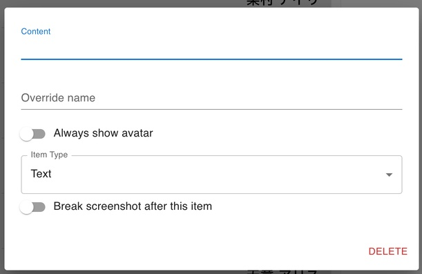
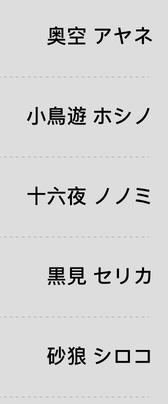
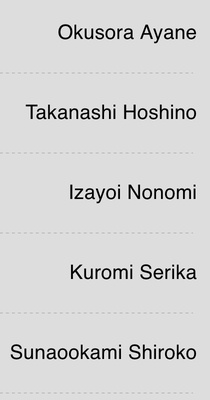

Localization in Closure Talk
---

Closure Talk supports five languages: Chinese (Simplified), Chinese (Traditional), English, Japanese, and Korean. The choices are made based on the games it supports.

## Helping with Localization

If you are interested in contributing in the localization of Closure Talk (thanks!), this document will give you an idea of what is involved and how to get started.

The localization (translation) tasks in closure talk can be split into two categories:

- _The App iteslf_, mostly the user interface text (e.g., caption of buttons and options)
- _Game-specific content_, like character names

There are different procedures to work on these translations that we discuss below. In general, you'll [fork a repository](https://docs.github.com/en/pull-requests/collaborating-with-pull-requests/working-with-forks/about-forks) use [Pull Requests](https://docs.github.com/en/pull-requests/collaborating-with-pull-requests/proposing-changes-to-your-work-with-pull-requests/about-pull-requests) to add your translations. If it's a small change, you can also file an issue and we'll fix that on our end.

Feel free to file issues to raise questions as well.

## Localizing the App

The translations of the UI text is stored in [public/locales](https://github.com/ClosureTalk/closure-talk/tree/master/public/locales). Each language has its own folder containing a `translation.json` file:

- [English](https://github.com/ClosureTalk/closure-talk/blob/master/public/locales/en/translation.json)
- [Chinese (S)](https://github.com/ClosureTalk/closure-talk/blob/master/public/locales/zh-CN/translation.json)
- [Chinese (T)](https://github.com/ClosureTalk/closure-talk/blob/master/public/locales/zh-TW/translation.json)
- [Japanese](https://github.com/ClosureTalk/closure-talk/blob/master/public/locales/ja/translation.json)
- [Korean](https://github.com/ClosureTalk/closure-talk/blob/master/public/locales/ko/translation.json)

A json file contains key-value pairs. Each key correspond to a location (like a button) in the app, and the value is the text to be displayed at that location for the language. **Empty values are missing translations** and English text will be shown.

To provide new translations or fix existing ones, fork this repository and edit the corresponding `translation.json` file. Make sure that you don't change any keys, only the values.

## Localizing Game Content

 

Localization of game content is more complicated. Since many games have international releases, we can usually obtain many of the translations automatically from game resources.

However, each game is different in details, and we have to document them individually:

- [Arknights](arknights)
- [Blue Archive](blue-archive)
